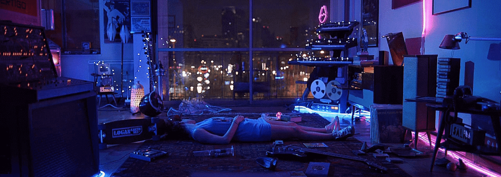
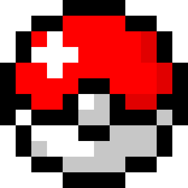

  

####

I'm a Full Stack Web Developer passionate in learning the many parts that bring websites and applications to life. Beyond the technical aspects, I love that web development allows me to implement my unique creative elements to my work. I'm particularly interested in seeing how I can integrate my web development skills with hardware, IoT, blockchain, and artificial intelligence to blend technology and creativity in innovative ways.

<h4 align="center">My Top Skills</h4>

  
  
  
  
  
  
  
  
  
  
  

  
  
  
  
  
  
  
  
  
  
  
  
  

  

    
    
  

- Want to transform your ideas to reality? I can help make it happen. Reach out via <a href="mailto:mrmendoza171@gmail.com">email</a> or thru my <a href="https://mrmendoza.dev">website<a/>. 

  

<!--

  

 
 
  
 

 

-->
